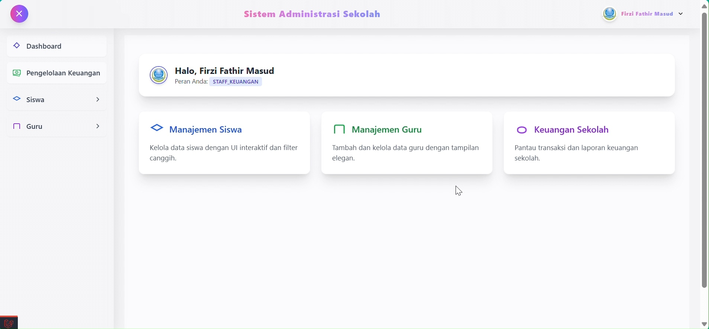

# 🎓 Sistem Administrasi Sekolah  
> Fullstack Web App berbasis **Laravel 10 + TailwindCSS** untuk manajemen administrasi sekolah  


---

## 📸 Preview
Tampilan modern & responsif menggunakan **TailwindCSS**.



---

## 🎥 Demo Interaktif
Lihat sistem berjalan langsung:  

.gif)  

---

## ✨ Fitur Utama
- 📚 **Manajemen Data Siswa** (CRUD data siswa & guru)  
- 🏫 **Manajemen Kelas & Jadwal**  
- 🧾 **Pencatatan Administrasi & Pembayaran**  
- 📊 **Dashboard Interaktif** dengan grafik statistik  
- 🔐 **Autentikasi & Role Management** (Admin, Guru, Siswa)  
- 📱 **Responsive Layout** (desktop & mobile friendly)  

---

## ⚡ Instalasi

```bash
# Clone repo
git clone https://github.com/username/sistem-administrasi-sekolah.git
cd sistem-administrasi-sekolah

# Install dependencies
composer install
npm install

# Copy env
cp .env.example .env

# Generate key
php artisan key:generate

# Migrasi database
php artisan migrate --seed

# Jalankan server
php artisan serve
npm run dev